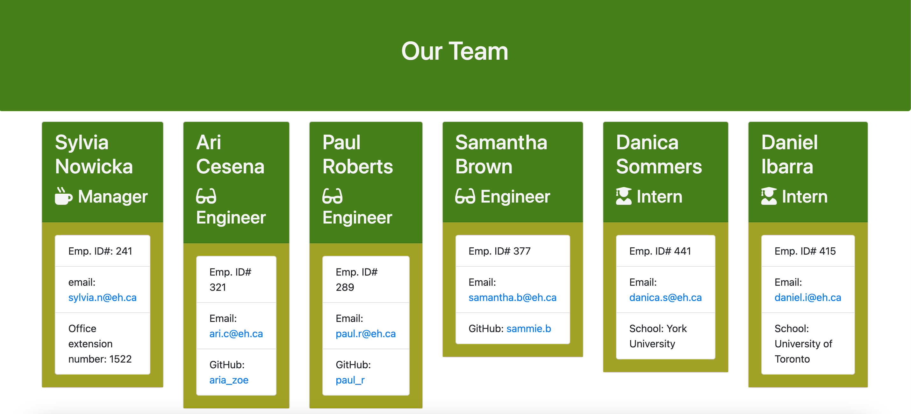

# Team Directory Generator  

## Description   
    This is command-line application meant to ask for the user's input to create a directory of team members. It will prompt for team members' name, employee ID, and email address. Furthermore, role-specific queries for additional relevant information will be shown for each role. At the end of the application's run, an html file will be created with the user's input and utilizing templates to render adequately.

## Table of Contents 
    *[Installation] (#installation) 
    *[Usage] (#usage)
    *[License] (#license) 
    *[Contributing Guidelines] (#contributing) 
    *[Tests] (#tests) 
    *[Questions] (#questions)

## Installation  
Copy the repository files; to ensure node dependencies are properly loaded please run the *npm install* command before running the *node app.js* command to begin the application.

## Usage  
Follow the application's prompts to generate the html directory. If a response isn't logged, an incomplete directory will result.

Check a video of the application walkthrough here: https://drive.google.com/file/d/1SG2Glr5Fx_iS49lccHiWTD1TQ1r6WolC/preview.

## License  
MIT License 

## Contributing 

The Contributor Covenant Code of Conduct 
https://www.contributor-covenant.org/version/2/0/code_of_conduct/code_of_conduct.md is applicable. 

## Tests  
Test(s) in development 

## Questions 
Email: hgarcia.millares@gmail.com  
GitHub: http://github.com/hector-gm;

